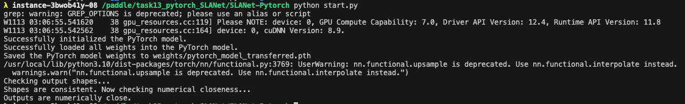
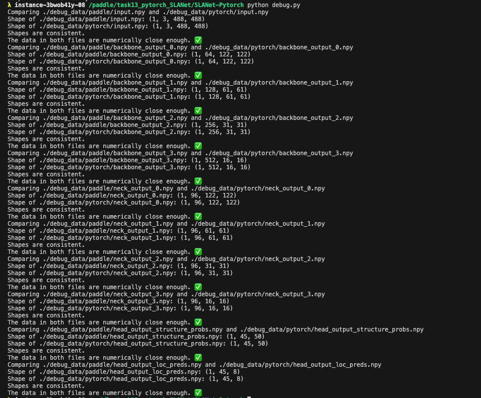

# Pytorch Implementation of PP-SLANet

## Introduction
This project is a Pytorch implementation of the SLANet originally developed in the Paddle framework for table recognition. Currently, it only includes the inference part, with the decoding component still under development.

## Usage Instructions

### Prerequisites
Ensure that both Paddle and Pytorch are installed in your environment.

### Running Inference
To run inference directly, execute:
```bash
python start.py
```
Example Image:



### Verifying Inference Consistency with Paddle
To check if the inference results are consistent with those of the original Paddle implementation:
1. Set `DEBUG = True` at the top of `lib/Arch/PaddleBaseModel.py` and `PytorchBaseModel.py`.
2. Save the data by running:
   ```bash
   python start.py
   ```
3. Verify the consistency of outputs at each stage by running:
   ```bash
   python debug.py
   ```
4. Example Image

    Here is an example image from our debug process:

    

### Implementation Process
The architecture of SLANet typically comprises PPLCNet (backbone) + CSPPAN (neck) + SLAHead (head). These components were extracted from the original PP-OCR and implemented in Pytorch sequentially. The Pytorch BaseModel was structured following the connectivity logic of the PaddleBaseModel. For simplicity, we did not use CONFIG parameters to build the network but manually set the parameters for each stage in `lib/Arch/paddle_build.py` and `pytorch_build.py`, since the model is singular.

In `start.py`, I use Paddle to load the parameters of the pre-trained PP-SLANet model, and then assign it layer by layer to the SLANet model, and finally perform inference, and compare the output results.

## 简介
本项目是使用Pytorch框架重写的SLANet（表格识别），原始版本基于Paddle框架开发。目前，项目仅包含推理部分，解码部分尚未编写。

## 使用说明

### 前提
请确保已经在您的环境中安装了paddle和pytorch。

### 直接运行推理
执行以下命令直接运行推理：
```bash
python start.py
```
示例图片:


### 验证推理结果与Paddle的一致性
若需检查推理结果是否与Paddle版一致，请按以下步骤操作：
1. 在`lib/Arch/PaddleBaseModel.py`和`PytorchBaseModel.py`的最上方将`DEBUG`设置为`True`。
2. 运行以下命令保存数据：
   ```bash
   python start.py
   ```
3. 运行以下命令验证每个阶段的输出是否一致：
   ```bash
   python debug.py
   ```
4. 示例图片
   
   以下是我们的debug过程中的一张示例图片：
   
   

### 整体实现流程
SLANet的架构通常包括PPLCNet（主干网络）+ CSPPAN（颈部网络）+ SLAHead（头部网络）。这些部分从原始的PP-OCR中提取出并依次用Pytorch实现。Pytorch的BaseModel是根据PaddleBaseModel的连接逻辑构建的。为了简化过程，我们没有使用CONFIG参数来构建网络，而是在`lib/Arch/paddle_build.py`和`pytorch_build.py`中直接手动设置了每个阶段的参数，毕竟模型是单一的。

在start.py中，我使用Paddle加载了预训练的PP-SLANet模型的参数，然后逐层赋值给Pytorch框架构建的SLANet模型，最后进行推理，并比较输出结果是否一致。

### 参考资料
[PP-OCR](https://github.com/PaddlePaddle/PaddleOCR)

[CSDN Liekkas Kono](https://blog.csdn.net/shiwanghualuo/article/details/129132206)

[Pytorch-Paddle API Mapping](https://www.paddlepaddle.org.cn/documentation/docs/zh/guides/model_convert/convert_from_pytorch/pytorch_api_mapping_cn.html)